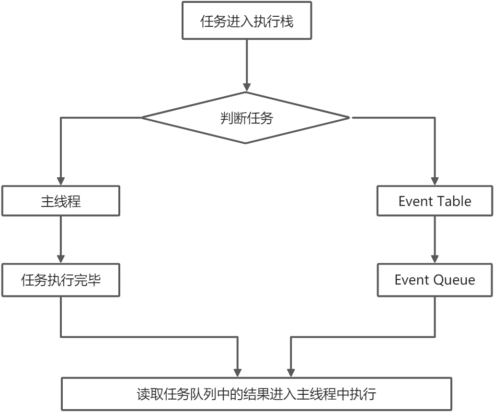

# Promise

### [任务队列](https://www.yuque.com/wuchendi/fe/sd4f1v)



### Promise 的作用

`Promise` 就是为了解决“回调地狱”问题的，它可以将异步操作的处理变得很优雅。回调地狱，代码难以维护， 常常第一个的函数的输出是第二个函数的输入这种现象 `Promise` 可以支持多个并发的请求，获取并发请求中的数据这个 `Promise` 可以解决异步的问题，本身不能说 `Promise` 是异步的。

> Promise 状态：pending - **[待定]初始状态**、fulfilled - **[实现]操作成功**、rejected - **[被否决]操作失败**
> Promise 会根据状态来确定执行哪个方法
> Promise 实例化时状态默认为 pending 的，如异步状态异常 rejected，反之 fulfilled

> 注意：状态转化是单向的，不可逆转，已经确定的状态（fulfilled/rejected）无法转回初始状态（pending），而且只能是从 pending 到 fulfilled 或者 rejected

### Promise 的基本用法

```javascript
{
	// 基本定义
	let ajax = function (callback) {
		console.log("执行"); // 执行
		setTimeout(function () {
			callback && callback.call();
		}, 1000);
	};
	ajax(function () {
		console.log("timeout1"); // timeout1
	});
}

{
	let ajax = function () {
		console.log("执行2");
		return new Promise(function (resolve, reject) {
			setTimeout(function () {
				resolve();
			}, 1000);
		});
	};
	ajax().then(function () {
		console.log("Promise", "timeout2"); // Promise  timeout2
	});
}

{
	let ajax = function () {
		console.log("执行3"); // 执行3
		return new Promise(function (resolve, reject) {
			setTimeout(function () {
				resolve();
			}, 1000);
		});
	};
	ajax()
		.then(function () {
			return new Promise(function (resolve, reject) {
				setTimeout(function () {
					resolve();
				}, 2000);
			});
		})
		.then(function () {
			console.log("timeout3"); // timeout3
		});
}

{
	let ajax = function (num) {
		console.log("执行4"); // 执行4 执行4
		return new Promise(function (resolve, reject) {
			if (num > 5) {
				resolve();
			} else {
				throw new Error("出错了");
			}
		});
	};
	ajax(6)
		.then(function () {
			console.log("log", 6); // log 6
		})
		.catch(function (err) {
			console.log("catch", err);
		});

	ajax(3)
		.then(function () {
			console.log("log", 3);
		})
		.catch(function (err) {
			console.log("catch", err); // catch [Error: 出错了]
		});
}
```

### Promise.all() 批量执行

> Promise.all([a1, a2, a3])用于将多个 promise 实例，包装成一个新的 Promise 实例，返回的实例就是普通的 promise
> 它接收一个数组作为参数

> 数组里可以是 Promise 对象，也可以是别的值，只有 Promise 会等待状态改变

> 当所有的子 Promise 都完成，该 Promise 完成，返回值是全部值得数组

> 有任何一个失败，该 Promise 失败，返回值是第一个失败的子 Promise 结果

```javascript
{
	// 所有图片加载完在添加到页面
	function loadImg(src) {
		return new Promise((resolve, reject) => {
			let img = document.createElement("img");
			img.src = src;
			img.onload = function () {
				resolve(img);
			};
			img.onerror = function (err) {
				reject(err);
			};
		});
	}

	function showImgs(imgs) {
		imgs.forEach(function (img) {
			document.body.appendChild(img);
		});
	}

	Promise.all([
		loadImg("https://gitee.com/uploads/85/1803985_WuChenDi.png?1525674217"),
		loadImg("http://i4.buimg.com/567751/2b07ee25b08930ba.png"),
		loadImg("http://i2.muimg.com/567751/5eb8190d6b2a1c9c.png"),
	]).then(showImgs);
}
```

### Promise.race()

> 类似于 Promise.all() ，区别在于它有任意一个完成就算完成

```javascript
{
	// 有一个图片加载完就添加到页面
	function loadImg(src) {
		return new Promise((resolve, reject) => {
			let img = document.createElement("img");
			img.src = src;
			img.onload = function () {
				resolve(img);
			};
			img.onerror = function (err) {
				reject(err);
			};
		});
	}

	function showImgs(img) {
		let p = document.createElement("p");
		p.appendChild(img);
		document.body.appendChild(p);
	}
	Promise.race([
		loadImg("https://gitee.com/uploads/85/1803985_WuChenDi.png?1525674217"),
		loadImg("http://i4.buimg.com/567751/2b07ee25b08930ba.png"),
		loadImg("http://i2.muimg.com/567751/5eb8190d6b2a1c9c.png"),
	]).then(showImgs);
}
```
