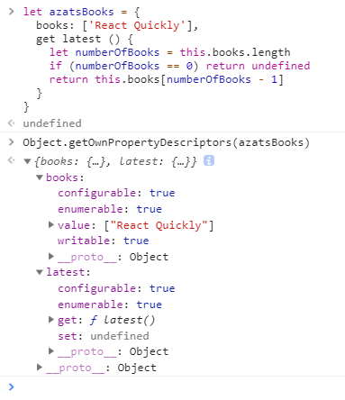

# ES8新特性
1. Object.values/Object.entries

    Object.values和 Object.entries是在ES2017规格中，它和Object.keys类似，返回数组类型，其序号和Object.keys序号对应。

    Object.values,Object.entries和Object.keys各自项返回是数组，相对应包括key,value或者可枚举特定对象property/attribute

    在ES8 /ES2017之前，Javascript开发者需要迭代一个对象的自身属性时候不得不用Object.keys，通过迭代且使用obj[key]获取value值返回一个数组：
    ```js
    let obj = {a: 1, b: 2, c: 3}
    Object.keys(obj).forEach((key, index)=>{
      console.log(key, obj[key])
    })
    ```

    而使用ES6/ES2015 中for/of稍微好点：
    ```js
    let obj = {a: 1, b: 2, c: 3}
    for (let key of Object.keys(obj)) {
      console.log(key, obj[key])
    }
    ```
    你使用老方式for/in(ES5)也许用的非常好。但是他会迭代所有可以枚举属性（像原型中的带名字的-see MDN）,不仅仅自己的属性，会意外的破坏那些 像prototype和tostring得到意想不到的值。

    Object.values返回对象自身可以迭代属性值（values）为数组类型。我们最好使用Array.prototype.forEach迭代它，结合ES6的箭头函数隐形返回值：
    ```js
    let obj = {a: 1, b: 2, c: 3}
    Object.values(obj).forEach(value=>console.log(value)) // 1, 2, 3
    ```

    或者使用for/of:
    ```js
    let obj = {a: 1, b: 2, c: 3}
    for (let value of Object.values(obj)) {
      console.log(value)
    }
    // 1, 2, 3
    ```

    Object.entries·，在另一方面，将会返回对象自身可迭代属性key-value对数组（作为一个数组），他们（key-value）分别以数组存放数组中。
    ```js
    let obj = {a: 1, b: 2, c: 3}
    JSON.stringify(Object.entries(obj))
    "[["a",1],["b",2],["c",3]]"
    ```

    我们可以使用ES6/ES2015解构（需要深入了解解构请点击这篇文章和课程）,从这嵌套数组中分别声明key和value
    ```js
    let obj = {a: 1, b: 2, c: 3}
    Object.entries(obj).forEach(([key, value]) => {
    console.log(`${key} is ${value}`)
    })
    // a is 1, b is 2, c is 3
    ```

    你可以猜一猜，我们同样使用ES6for/of（毕竟全部都是数组）遍历Object.entries返回来的结果值。
    ```js
    let obj = {a: 1, b: 2, c: 3}
    for (let [key, value] of Object.entries(obj)) {
      console.log(`${key} is ${value}`)
    }
    // a is 1, b is 2, c is 3
    ```

    现在从对象中提取values和key-value pairs 变得非常容易了。Object.values和Object.entries这种方式不想之前 Object.keys(自身属性key+顺序相同)结合for/of(ES6)一起，我们不仅仅可以提取他们还可以迭代他们。

2. 字符填充函数padStart 和 padEnd
    String.prototype.padStart 和 String.prototype.padEnd在javascript字符操作是一个不错的体验，帮助避免依赖而外的库。

    padStart()在开始部位填充，返回一个给出长度的字符串，填充物给定字符串，把字符串填充到期望的长度。从字符串的左边开始（至少大部分西方语言），一个经典例子是使用空格创建列：
    ```js
    console.log('react'.padStart(10).length)         // "       react" is 10
    console.log('backbone'.padStart(10).length)         // "  backbone" is 10
    ```

    它对于财务方面非常有用：
    ```js
    console.log('0.00'.padStart(20))            
    console.log('10,000.00'.padStart(20))    
    console.log('250,000.00'.padStart(20)) 
    ```

    这结果作为一个会计总账格式非常漂亮：
    ```js
                0.00
           10,000.00
          250,000.00
    ```

    第二个参数，让我们放一些其他的填充字符替代空字符串，一个字符串填充：
    ```js
    console.log('react'.padStart(10, '_'))         // "_____react"
    console.log('backbone'.padStart(10, '*'))         // "**backbone"
    ```

    padEnd顾名思义就是从字符串的尾端右边开始填充。第二个参数，你能实际上用一个任何长度的字符串。例如：
    ```js
    console.log('react'.padEnd(10, ':-)'))         // "react:-):-" is 10
    console.log('backbone'.padEnd(10, '*'))         // "backbone**" is 10
    ```

3. Object.getOwnPropertyDescriptors

    这新的 Object.getOwnPropertyDescriptors返回对象obj所有自身属性描述。这是一个多参数版本的Object.getOwnPropertyDescriptors(obj,propName)将会返回obj中propName属性的一个单独描述。

    在我们日常不可变编程（immutable programming）时代中，有了这个方法很方便（记住,Javascript中对象是引用传递）在ES5中，开发者要使用Object.assign()来拷贝对象, Object.assign()分配属性只有copy和定义新的属性。当我们使用更加复杂对象和类原型，这可能会出问题。

    Object.getOwnPropertyDescriptors允许创建真实的对象浅副本并创建子类,它通过给开发者描述符来做到这一点.在Object.create(prototype, object)放入描述符后，返回一个真正的浅拷贝

    ```js
    Object.create(
      Object.getPrototypeOf(obj),
      Object.getOwnPropertyDescriptors(obj)
    )
    ```

    或者你可以合并两个对象target和source如下：
    ```js
    Object.defineProperties(
      target,
      Object.getOwnPropertyDescriptors(source)
    )
    ```
    两种描述符号类型：
    1. 数据描述符（Data descriptor）
    2. 存取器描述符（Accessor descriptor）

    存取描述符有必须属性：get 或者set或者get和set两个就是如你所想的getter和setter函数，然后存取描述符还有可选属性configurable和enumerable
    ```js
    let azatsBooks = {  
      books: ['React Quickly'],
      get latest () {
        let numberOfBooks = this.books.length
        if (numberOfBooks == 0) return undefined
        return this.books[numberOfBooks - 1]
      }
    }
    ```
    

4. 函数参数列表和调用中的尾逗号（Trailing commas）
    尾逗号在函数定义中只是一个纯粹语法变化，在ES5中，将会非法语法，在函数参数后面应该是没有逗号的：
    ```js
    var f = function(a,
      b,
      c,
      d) { // NO COMMA!
      // ...
      console.log(d)
    }
    f(1,2,3,'this')
    ```

    在ES8中，这种尾逗号是没有问题的：
    ```js
    var f = function(a,
      b,
      c,
      d,
    ) { // COMMA? OK!
      // ...
      console.log(d)
    }
    f(1,2,3,'this')
    ```

    现在，函数中尾逗号是向数组（ES3）中和字面量对象（ES5）中尾逗号看齐。
    ```js
    var arr = [1,  // Length == 3
      2,
      3,
    ]  // <--- ok
    let obj = {a: 1,  // Only 3 properties
      b: 2,
      c: 3,
    }  // <--- ok
    ```
    更不用说他是无用友好的。

    尾逗号主要有用在使用多行参数风格（典型的是那些很长的参数名），开发者终于可以忘记逗号放在第一位这种奇怪的写法。自从逗号bugs主要原因就是使用他们。而现在你可以到处使用逗号，甚至最后参数都可以。

5. 异步函数（Async Functions）

    异步函数（或者async/await）特性操作是Promise最重要的功能，开发者定义一个asyc函数里面不包含或者包含await 基于Promise异步操作

    在ES6中我们可以使用Promise，Axios库向GraphQL服务器发送一个请求：
    ```js
    axios.get(`/q?query=${query}`)
      .then(response => response.data)
      .then(data => {
        this.props.processfetchedData(data) // Defined somewhere else
      })
      .catch(error => console.log(error))
    ```

    任何一个Promise库都能兼容新的异步函数，我们可以使用同步try/catch做错误处理。
    ```js
    async fetchData(url) => {
      try {
        const response = await axios.get(`/q?query=${query}`)
        const data = response.data
        this.props.processfetchedData(data)
      } catch (error) {
        console.log(error)
      }
    }
    ```

    异步函数返回一个Promise，所以我们像下面可以继续执行流程:
    ```js
    async fetchData(query) => {
      try {
        const response = await axios.get(`/q?query=${query}`)
        const data = response.data
        return data
      } catch (error) {
        console.log(error)
      }
    }
    fetchData(query).then(data => {
      this.props.processfetchedData(data)
    })
    ```

    你可以看到这段代码在(Babel REPL)生效。请注意，这个例子中，Axios库被代替的，是通过模拟来做相同功能，而HTTP请求通过setTimout代替：
    ```js
    let axios = {  // mocks
      get: function(x) {
      return new Promise(resolve => {
        setTimeout(() => {
          resolve({data: x})
        }, 2000)
      })
    }}
    let query = 'mangos'
    async function fetchData(query) {
      try {
        const response = await axios.get(`/q?query=${query}`)
        const data = response.data
        return data
      } catch (error) {
        console.log(error)
      }
    }
    fetchData(query).then(data => {
      console.log(data) // Got data 2s later... Can use data!
    })
    ```

    有了 async/await,我们的代码执行异步看起来像执行同步一样。可以从头到尾读起来非常简单和易懂，因为出现结果顺序和函数题中从头到尾顺序一样啊！

原文链接：https://www.jianshu.com/p/a138a525c287