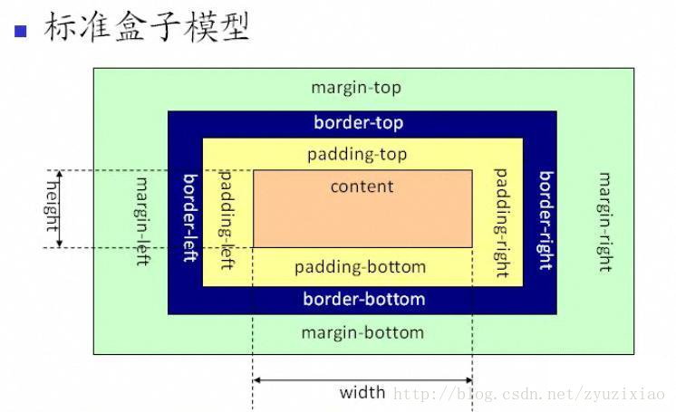
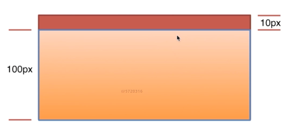
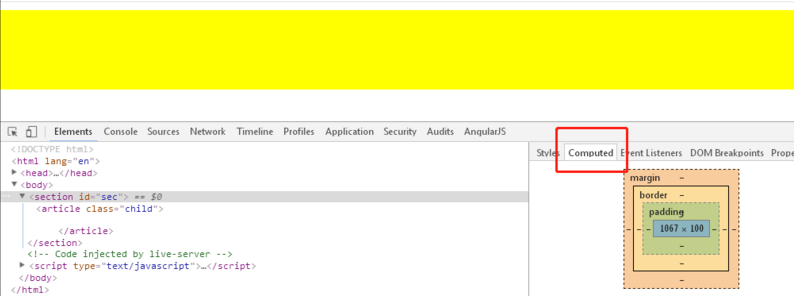
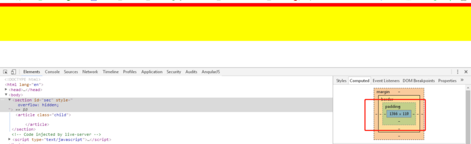

# 谈谈你对 CSS 盒模型的认识

1. 基本概念：标准模型 + IE 模型(区别)
2. CSS 如何设置这两种模型
3. JS 如何设置获取盒子模型对应的宽和高
4. 实例题(根据盒模型解释边距重叠)
5. BFC(边距重叠解决方案)

## CSS 盒模型

1. 基本概念：标准模型+ IE 模型

   

   从上图可以看到标准 W3C 盒子模型的范围包括 margin、border、padding、content，并且 content 部分不包含其他部分。

   

   从上图可以看到 IE 盒子模型的范围也包括 margin、border、padding、content，和标准 W3C 盒子模型不同的是：IE 盒子模型的 content 部分包含了 border 和 pading。

2. CSS 如何设置这两种模型

   ``` css
   <!-- 标准模型 -->
   box-sizing:conent-box;
   <!-- IE盒模型 -->
   box-sizing:border-box;

   浏览器默认方式为:box-sizing:conent-box
   ```

3. JS 如何设置获取盒子模型对应的宽和高

   ```JS
   dom.style.width/height
   dom.currentStyle.width/height  (ie支持)
   window.getComputedStyle(dom).width/height;
   dom.getBoundingClientRect().width/height;
   ```

4. 实例题(根据盒模型解释边距重叠)

   

   如上图:有两个元素其中子元素高度为 100px,子元素与父元素的上边距为 10px,求父元素的实际高度？

   答案: 说 100px 对，说 110 也对，为什么捏？这个要看父元素的盒模型要怎么设置的

   ```html
   <style>
     html,
     * {
       padding: 0;
       margin: 0;
     }
     #sec {
       background: #f00;
     }
     .child {
       height: 100px;
       margin-top: 10px;
       background: yellow;
     }
   </style>
   <body>
     <section id="sec">
       <article class="child"></article>
     </section>
   </body>
   ```

   运行效果：

   

   上图证明 100px 是对的

   元素加个 overflow:hidden

   

   你会发现这时高度为 110px, 这时大家可能会疑问,为什么给父级元素设置一个 overflow:hidden 以后，它的高度就成 110 呢，这块的基本原理是啥呢，咋就这样呢？说这个之前，先引用一个知识点：

   上面代码是父子元素边距重叠，那么还有两种情况边距重叠就是，一种是兄弟元素，就是两个 div 挨着，每个都上边距或者下边距，那么重叠的原则就是取最大值。

   来回答上面问题：给父级加了 overflow:hidden,其实就是给父级元素创建一个 BFC(块级格式化上下文)，那什么是 BFC，请看下一个话。

5. BFC(边距重叠解决方案)

- BFC 的基本概念
- BFC 的原理
- 如何创建 BFC
- BFC 使用场景

### BFC 的基本概念

Block Formatting Context, 块级格式化上下文，一个独立的块级渲染区域，该区域拥有一套渲染规格来约束块级盒子的布局，且与区域外部无关。

### BFC 的原理

- BFC 这个元素的垂直的边距会发生重叠
- BFC 的区域不会与浮动元素的 float 重叠
- 独立的容器，内外元素互不影响
- 计算 BFC 高度，浮动元素也参与计算

### 如何创建 BFC

- float 不为 none 的时候
- position 不为 static 或者 relative 的时候
- display 与 table 相关的时候
- overflow 为 auto, hidden 的时候

### BFC 使用场景

- BFC 垂直方向边距重叠

  ```html
  <section id="margin">
    <style>
      #margin {
        background: pink;
        overflow: hidden;
      }
      #margin > p {
        margin: 5px auto 25px;
        background: red;
      }
    </style>
    <p>1</p>
    <div style="overflow:hidden">
      <p>2</p>
    </div>
    <p>3</p>
  </section>
  ```

- BFC 不与 float 重叠

  ```html
  <section id="layout">
    <style media="screen">
      #layout {
        background: red;
      }
      #layout .left {
        float: left;
        width: 100px;
        height: 100px;
        background: pink;
      }
      #layout .right {
        height: 110px;
        background: #ccc;
        overflow: auto;
      }
    </style>
    <div class="left"></div>
    <div class="right"></div>
  </section>
  ```

- BFC 子元素即使是 float 也会参与计算

  ```html
  <section id="float">
    <style media="screen">
      #float {
        background: red;
        overflow: auto;
        /*float: left;*/
      }
      #float .float {
        float: left;
        font-size: 30px;
      }
    </style>
    <div class="float">我是浮动元素</div>
  </section>
  ```
