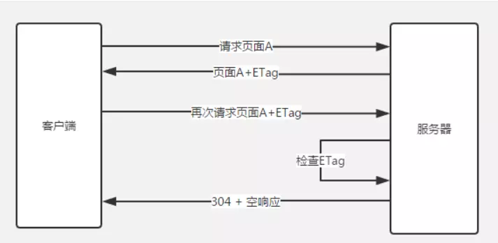

# 页面性能类

提升页面性能的方法有哪些？

1. 资源压缩合并，减少 HTTP 请求
2. 非核心代码异步加载 -> 异步加载的方式 -> 异步加载的区别
3. 利用浏览器缓存 -> 缓存的分类 -> 缓存的原理
4. 利用 CDN
5. 预解析 DNS

<!-- 减少域名查找，
开启CDN，
首屏样式内联，
样式预加载，
JS后置，
图片懒加载，图片压缩，背景小图片组成集合图
开启gzip压缩
设置静态文件过期时间
开启缓存控制cache-control expires last-modified
配置etag
减少http请求组合文件
压缩样式文件，脚本文件
图标用字体图标代替
静态资源过多单独部署 -->

## 资源压缩与合并

主要包括这些方面：html 压缩、css 压缩、js 的压缩和混乱和文件合并。

资源压缩可以从文件中去掉多余的字符，比如回车、空格。你在编辑器中写代码的时候，会使用缩进和注释，这些方法无疑会让你的代码简洁而且易读，但它们也会在文档中添加多余的字节

- html 压缩

  html 代码压缩就是压缩这些在文本文件中有意义，但是在 HTML 中不显示的字符，包括空格，制表符，换行符等，还有一些其他意义的字符，如 HTML 注释也可以被压缩。

  ```md
  使用在线网站进行压缩(开发过程中一般不用)

  nodejs 提供了 html-minifier 工具

  后端模板引擎渲染压缩
  ```

- css 压缩

  css 代码压缩简单来说就是无效代码删除和 css 语义合并

  ```md
  使用在线网站进行压缩(开发过程中一般不用)

  使用 html-minifier 工具

  使用 clean-css 对 css 压缩
  ```

- js 的压缩和混乱

  js 的压缩和混乱主要包括以下这几部分：

  1. 无效字符的删除
  2. 剔除注释
  3. 代码语义的缩减和优化
  4. 代码保护(代码逻辑变得混乱，降低代码的可读性，这点很重要)

  ```md
  使用在线网站进行压缩(开发过程中一般不用)

  使用 html-minifier 工具

  使用 uglifyjs2 对 js 进行压缩
  ```

## 异步加载([code](https://github.com/WuChenDi/Front-End/blob/master/04-%E9%9D%A2%E8%AF%95/2018%E5%B9%B4%E5%BA%95Coding/perfomance.html))

- 异步加载的方式：动态脚本创建、defer、async

  - 动态脚本创建

    在还没定义 defer 和 async 前，异步加载的方式是动态创建 script，通过 window.方法确保页面加载完毕再将 script 标签插入到 DOM 中,具体代码如下：

    ```js
    function addScriptTag(src) {
      var script = document.createElement('script');
      script.setAttribute("type", "text/javascript");
      script.src = src;
      document.body.appendChild(script);
    }
    window. = function () {
      addScriptTag("js/index.js");
    }
    ```

  - defer

    - 兼容所有浏览器
    - defer 属性规定是否对脚本执行进行延迟，直到页面加载为止
    - 如果是多个脚本，该方法可以确保所有设置了 defer 属性的脚本按顺序执行
    - 如果脚本不会改变文档的内容，可将 defer 属性加入到 script 标签中，以便加快处理文档的速度

    ```js
    <script defer type="text/javascript" src="xxx.js"></script>
    ```

  - async

    - async 属性是 HTML5 新增属性，需要 Chrome、FireFox、IE9+浏览器支持
    - async 属性规定一旦脚本可用，则会异步执行
    - async 属性仅适用于外部脚本
    - 如果是多个脚本，该方法不能保证脚本按顺序执行

    ```js
    <script async type="text/javascript" src="xxx.js"></script>
    ```

- 异步加载的区别
  - defer 是在 HTML 解析完之后才会执行，如果是多个，按照加载的顺序依次执行
  - async 是在加载完之后立即执行，如果是多个，执行顺序和加载顺序无关

## 浏览器缓存

浏览器缓存类型

1. 强缓存：不会向服务器发送请求，直接从缓存中读取资源

   Expires ：response header 里的过期时间，浏览器再次加载资源时，如果在这个过期时间内，则命中强缓存。它的值为一个绝对时间的 GMT 格式的时间字符串， 比如 Expires: Sat, 29 Dec 2018 01:24:06 GMT

   Cache-Control ：这是一个相对时间，在配置缓存的时候，以秒为单位，用数值表示。当值设为 max-age=3600 时，则代表在这个请求正确返回时间（浏览器也会记录下来）的 60 分钟内再次加载资源，就会命中强缓存。比如 Cache-Control:max-age=3600

   简单概括：其实这两者差别不大，区别就在于 Expires 是 http1.0 的产物，Cache-Control 是 http1.1 的产物，**两者同时存在的话，Cache-Control 优先级高于 Expires**

   在某些不支持 HTTP1.1 的环境下，Expires 就会发挥用处。所以 Expires 其实是过时的产物，现阶段它的存在只是一种兼容性的写法。强缓存判断是否缓存的依据来自于是否超出某个时间或者某个时间段，而不关心服务器端文件是否已经更新，这可能会导致加载文件不是服务器端最新的内容，那我们如何获知服务器端内容较客户端是否已经发生了更新呢？此时我们需要协商缓存策略。

2. 协商缓存：向服务器发送请求，服务器会根据这个请求的 request header 的一些参数来判断是否命中协商缓存，如果命中，则返回 304 状态码并带上新的 response header 通知浏览器从缓存中读取资源；另外协商缓存需要与 cache-control 共同使用。

   Last-Modified 和 If-Modified-Since ：当第一次请求资源时，服务器将资源传递给客户端时，会将资源最后更改的时间以“Last-Modified: GMT”的形式加在实体首部上一起返回给客户端。

   ```md
   Last-Modified: Sat, 29 Dec 2018 01:24:06 GMT
   ```

   客户端会为资源标记上该信息，下次再次请求时，会把该信息附带在请求报文中一并带给服务器去做检查，若传递的时间值与服务器上该资源最终修改时间是一致的，则说明该资源没有被修改过，**直接返回 304 状态码，内容为空**，这样就节省了传输数据量 。如果两个时间不一致，则服务器会发回该资源并返回 200 状态码，和第一次请求时类似。这样保证不向客户端重复发出资源，也保证当服务器有变化时，客户端能够得到最新的资源。一个 304 响应比一个静态资源通常小得多，这样就节省了网络带宽。

   Last-Modified 和 If-Modified-Since

   
   但 last-modified 存在一些缺点：

   - 某些服务端不能获取精确的修改时间
   - 文件修改时间改了，但文件内容却没有变

   既然根据文件修改时间来决定是否缓存尚有不足，能否可以直接根据文件内容是否修改来决定缓存策略？----ETag 和 If-None-Match

   ETag 和 If-None-Match：Etag 是上一次加载资源时，服务器返回的 response header，是对该资源的一种唯一标识，只要资源有变化，Etag 就会重新生成。浏览器在下一次加载资源向服务器发送请求时，会将上一次返回的 Etag 值放到 request header 里的 If-None-Match 里，服务器只需要比较客户端传来的 If-None-Match 跟自己服务器上该资源的 ETag 是否一致，就能很好地判断资源相对客户端而言是否被修改过了。如果服务器发现 ETag 匹配不上，那么直接以常规 GET 200 回包形式将新的资源（当然也包括了新的 ETag）发给客户端；如果 ETag 是一致的，则直接返回 304 知会客户端直接使用本地缓存即可。

   ETag 和 If-None-Match

   

   两者之间对比：

   首先在精确度上，Etag 要优于 Last-Modified。Last-Modified 的时间单位是秒，如果某个文件在 1 秒内改变了多次，那么他们的 Last-Modified 其实并没有体现出来修改，但是 Etag 每次都会改变确保了精度；如果是负载均衡的服务器，各个服务器生成的 Last-Modified 也有可能不一致。
   第二在性能上，Etag 要逊于 Last-Modified，毕竟 Last-Modified 只需要记录时间，而 Etag 需要服务器通过算法来计算出一个 hash 值。
   第三在优先级上，服务器校验优先考虑 Etag

   缓存的机制

   强制缓存优先于协商缓存进行，若强制缓存(Expires 和 Cache-Control)生效则直接使用缓存，若不生效则进行协商缓存(Last-Modified / If-Modified-Since 和 Etag / If-None-Match)，协商缓存由服务器决定是否使用缓存，若协商缓存失效，那么代表该请求的缓存失效，重新获取请求结果，再存入浏览器缓存中；生效则返回 304，继续使用缓存。主要过程如下：

   

   缓存的机制

   用户行为对浏览器缓存的影响

   1. 地址栏访问，链接跳转是正常用户行为，将会触发浏览器缓存机制；

   2. F5 刷新，浏览器会设置 max-age=0，跳过强缓存判断，会进行协商缓存判断；

   3. ctrl+F5 刷新，跳过强缓存和协商缓存，直接从服务器拉取资源。
