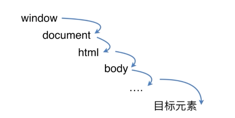

# DOM事件类
1. 基本概念：DOM事件的级别
2. DOM事件模型
3. DOM事件流
4. 描述DOM事件捕获的具体流
5. Event对象的常见应用
6. 自定义事件
7. 移动端触摸事件

## 事件级别
```js
  DOM0 element.=function(){}

  DOM2 element.addEventListener('click', function(){}, false)    //冒泡false和捕获true

  DOM3 element.addEventListener('keyup', function(){}, false)
```

## 事件流


## 描述DOM事件捕获的具体流程



```js
  window.addEventListener('click', function (e) {
    console.log('window captrue');
  }, true);
  
  document.addEventListener('click', function (e) {
    console.log('document captrue');
  }, true);

  document.documentElement.addEventListener('click', function (e) {
    console.log('html captrue');
  }, true);
  document.body.addEventListener('click', function (e) {
    console.log('body captrue');
  }, true);

  ev.addEventListener('click', function (e) {
    console.log('ev captrue');
  }, true);
```

## Event对象的常见应用

```js
  event. preventDefault()             // 阻止默认事件(a标签)
  event. stopPropagation()            // 阻止冒泡
  event. stoplmmediatePropagation()   //绑定两个事件触发A事件阻止B事件发生
  event. currentTarget                //返回绑定事件的元素
  event. target                       //返回触发事件的元素
```

## 自定义事件（[code](https://github.com/WuChenDi/Front-End/blob/master/04-%E9%9D%A2%E8%AF%95/2018%E5%B9%B4%E5%BA%95Coding/event.html)）

```js
  var eve = new Event('custome')
  ev.addEventListener('custome', function () {
    console.log('custome')
  })
  events.addEventListener('click', function () {
    window.dispatchEvent(eve)
  }, true)
```

## 移动端触摸事件

1. touchstart：当手指触碰到屏幕的时候触发
2. touchmove：当手指在屏幕上滑动的时候触发
3. touchend：当手指离开屏幕的时候时候触发
4. touchcancel事件：当系统停止跟踪触摸的时候触发(少用)

touches：表示当前跟踪的触摸操作的touch对象的数组。

targetTouches：特定于事件目标的Touch对象的数组。

changeTouches：表示自上次触摸以来发生了什么改变的Touch对象的数组。

每个touch对象包含的属性:

1. clientX：触摸目标在视口中的x坐标。
2. clientY：触摸目标在视口中的y坐标。
3. identifier：标识触摸的唯一ID。
4. pageX：触摸目标在页面中的x坐标。
5. pageY：触摸目标在页面中的y坐标。
6. screenX：触摸目标在屏幕中的x坐标。
7. screenY：触摸目标在屏幕中的y坐标。
8. target：触目的DOM节点目标。


## 冒泡
当点击一个元素触发事件时. 事件会先从元素的最外层父元素一层一层进入到触发的元素, 然后在从触发元素一层一层返回到最外层父元素, 从最外层一层一层进入的阶段叫事件捕获阶段, 从最里层一层一层往外的阶段叫事件冒泡

## 事件委托
事件委托就是利用事件冒泡，只指定一个事件处理程序，就可以管理某一类型的所有事件

好处：给重复的节点添加相同操作，减少dom交互，提高性能

实现思路：给父组件添加事件，通过事件冒泡，排查元素是否为指定元素，并进行系列操作