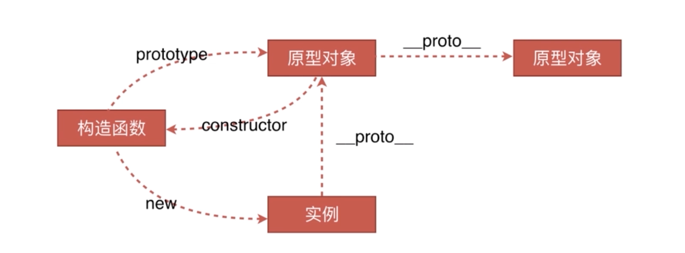
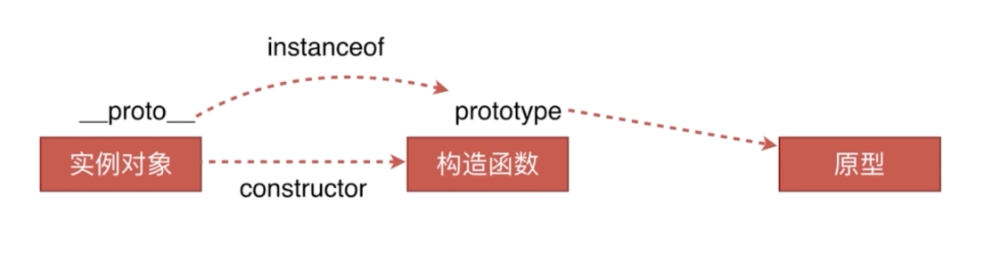

# 原型链（[code](https://github.com/WuChenDi/Front-End/blob/master/04-%E9%9D%A2%E8%AF%95/2018%E5%B9%B4%E5%BA%95Coding/proto.html)）

* 创建对象的几种方法
* 原型、构造函数、实例、原型链
* instanceof的原理
* new运算符

## 创建对象的几种方法
```js
  // 第一种方式：字面量
  var o1 = {name: 'o1'};
  var o2 = new Object({name: 'o2'});
  // 第二种方式：构造函数
  var M = function (name) { this.name = name; };
  var o3 = new M('o3');
  // 第三种方式：Object.create
  var p = {name: 'p'};
  var o4 = Object.create(p);
```

## 原型、构造函数、实例、原型链


对象是函数创建的，而函数却又是一种对象。也是属性的集合，可以对函数进行自定义属性。

每个函数都有一个属性叫做prototype。

这个prototype的属性值是一个对象，默认的只有一个叫做constructor的属性，指向这个函数本身。
```js
var Fn=function(){
   this.name='WuChenDi';
   this.old=22;
}
```


从上图可以看到对象的原型，指向构造函数的prototype属性。

f1.__proto__指向构造函数的prototype属性,就是对象的原型。所以f1.__proto__ === Fn.prototype为true

prototype的属性值是一个对象，默认的只有一个叫做constructor的属性，指向这个函数本身。

__proto__就是指向构造函数的prototype属性，Fn.prototype就是对象的原型

即,每个由构造函数创建的对象都有一个__proto__属性，指向创建该对象的函数的prototype。

```
var 对象名 = new 函数名()
对象名.__proto__=== 函数名.prototype
```

## instanceof



注：如果还有其他问题或者有错误，请在 Issues 中提出，我会尽力解答，原型链这个东西吧自己搞懵了

