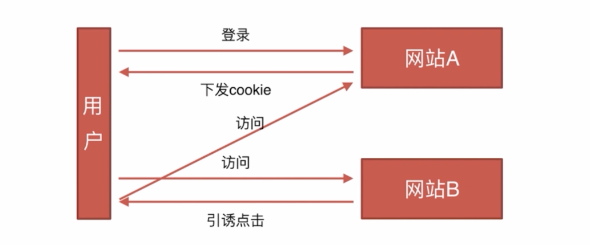

# 安全类

-   CSRF
-   XSS

## CSRF

-   基本概念和缩写

    CSRF（Cross-site request forgery）跨站请求伪造，也被称为“One Click Attack”或者 Session Riding，通常缩写为 CSRF 或者 XSRF，是一种对网站的恶意利用。

-   攻击原理

    
    CSRF攻击的主要目的是让用户在不知情的情况下攻击自己已登录的一个系统，类似于钓鱼。如用户当前已经登录了邮箱，或bbs，同时用户又在使用另外一个，已经被你控制的站点，我们姑且叫它钓鱼网站。这个网站上面可能因为某个图片吸引你，你去点击一下，此时可能就会触发一个js的点击事件，构造一个bbs发帖的请求，去往你的bbs发帖，由于当前你的浏览器状态已经是登陆状态，所以session登陆cookie信息都会跟正常的请求一样，纯天然的利用当前的登陆状态，让用户在不知情的情况下，帮你发帖或干其他事情。

-   防御措施

    通过 referer、token 或者 验证码 来检测用户提交

    尽量不要在页面的链接中暴露用户隐私信息

    对于用户修改删除等操作最好都使用 post 操作

    避免全站通用的 cookie，严格设置 cookie 的域

## XSS

-   基本概念

    XSS (Cross Site Scripting)，即跨站脚本攻击，是一种常见于 Web 应用中的计算机安全漏洞。恶意攻击者往 Web 页面里嵌入恶意的客户端脚本，当用户浏览此网页时，脚本就会在用户的浏览器上执行，进而达到攻击者的目的。比如获取用户的 Cookie、导航到恶意网站、携带木马等。

-   常见的 xss 攻击方法

    ```
    绕过XSS-Filter，利用<>标签注入Html/JavaScript代码；

    利用HTML标签的属性值进行xss攻击。例如：；（当然并不是所有的Web浏览器都支持Javascript伪协议，所以此类XSS攻击具有一定的局限性）

    空格、回车和Tab。如果XSS Filter仅仅将敏感的输入字符列入黑名单，比如javascript，用户可以利用空格、回车和Tab键来绕过过滤，例如：；

    利用事件来执行跨站脚本。例如：，当src错误的视乎就会执行onerror事件；

    利用CSS跨站。例如：Body {backgrund-image: url(“javascript:alert(‘xss’)”)}；

    扰乱过滤规则。例如：；

    利用字符编码，透过这种技巧，不仅能让XSS代码绕过服务端的过滤，还能更好地隐藏Shellcode；（JS支持unicode、eacapes、十六进制、十进制等编码形式）

    拆分跨站法，将xss攻击的代码拆分开来，适用于应用程序没有过滤 XSS关键字符（如<、>）却对输入字符长度有限制的情况下；

    DOM型的XSS主要是由客户端的脚本通过DOM动态地输出数据到页面上，它不依赖于提交数据到服务器，而是从客户端获得DOM中的数据在本地执行。容易导致DOM型的XSS的输入源包括：Document.URL、Location(.pathname|.href|.search|.hash)、
    Document.referrer、Window.name、Document.cookie、localStorage/globalStorage；
    ```

-   防御措施

    ```
    原则不相信客户输入的数据
    注意: 攻击代码不一定在<script></script>中

    1.使用XSS Filter。
    输入过滤，对用户提交的数据进行有效性验证，仅接受指定长度范围内并符合我们期望格式的的内容提交，阻止或者忽略除此外的其他任何数据。比如：电话号码必须是数字和中划线组成，而且要设定长度上限。过滤一些些常见的敏感字符，例如：< > ‘ “ & # \ javascript expression  "onclick="  "onfocus"；过滤或移除特殊的Html标签， 例如: <script>, <iframe> ,  &lt; for <, &gt; for >, &quot for；过滤JavaScript 事件的标签，例如 "onclick=", "onfocus" 等等。
    输出编码，当需要将一个字符串输出到Web网页时，同时又不确定这个字符串中是否包括XSS特殊字符（如< > &‘”等），为了确保输出内容的完整性和正确性，可以使用编码（HTMLEncode）进行处理。

    2.DOM型的XSS攻击防御
    把变量输出到页面时要做好相关的编码转义工作，如要输出到 <script>中，可以进行JS编码；要输出到HTML内容或属性，则进行HTML编码处理。根据不同的语境采用不同的编码处理方式。

    3.HttpOnly Cookie
    将重要的cookie标记为http only,   这样的话当浏览器向Web服务器发起请求的时就会带上cookie字段，但是在脚本中却不能访问这个cookie，这样就避免了XSS攻击利用JavaScript的document.cookie获取cookie：
    ```
