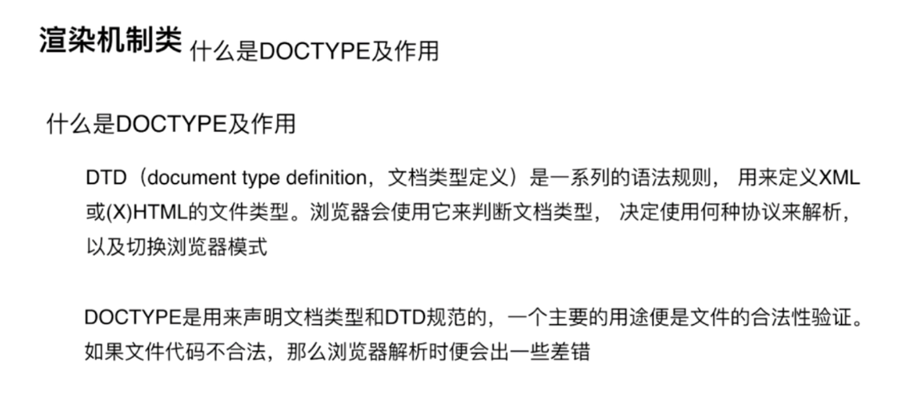
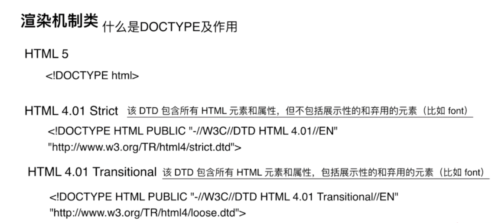
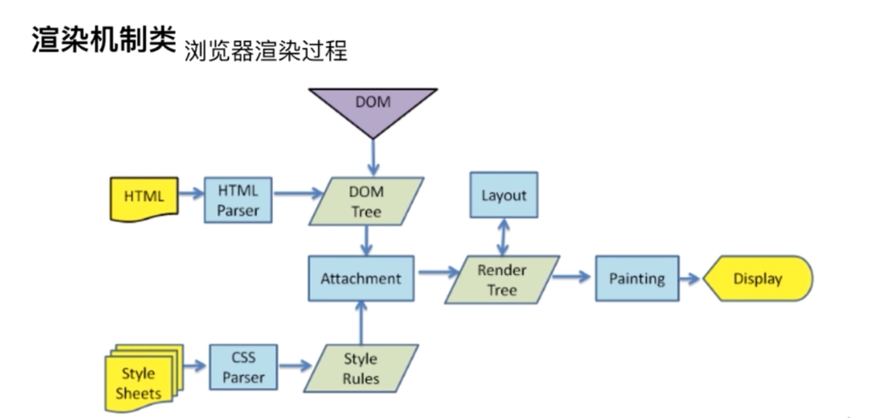
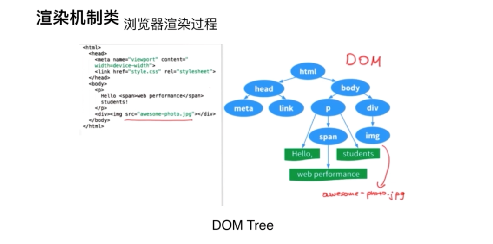
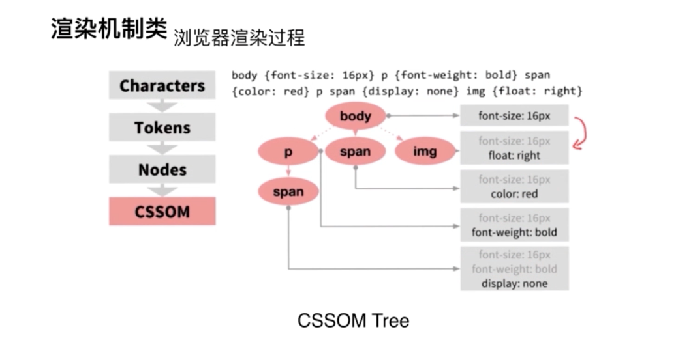
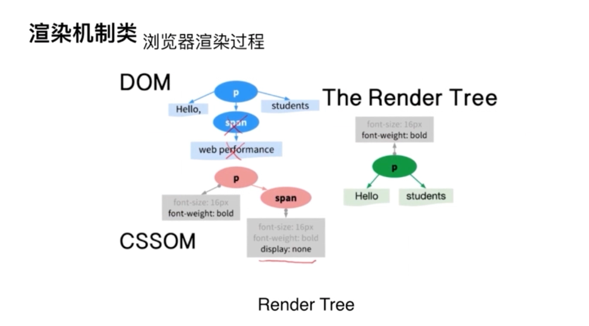
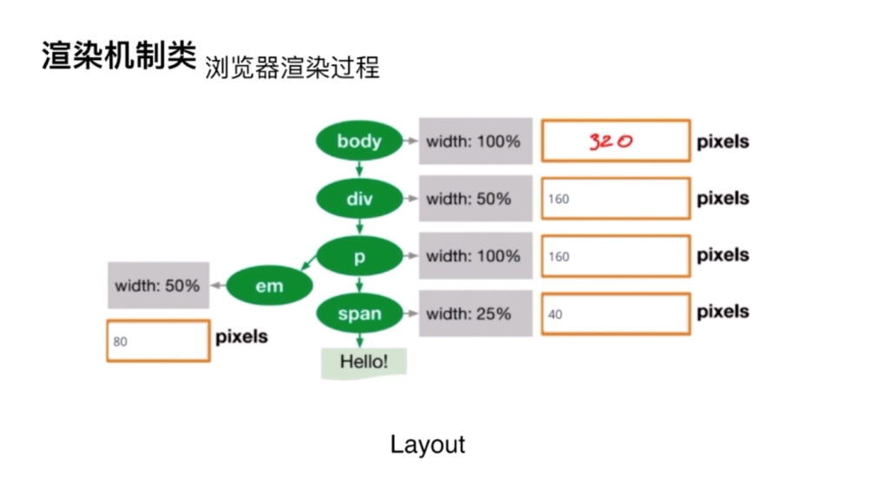

# 渲染机制

* 渲染机制：浏览器怎么渲染页面的。
* JS运行机制：js引擎以及浏览器之间怎么完成平时之间的交互的。
* 页面性能：你开发的页面卡不卡，你用什么方法保证你写的页面是流畅的。
* 错误监控：各大公司都有自己的代码质量体系，会通过代码提交的时候来控制。通过线上环境的错误收集，来监听你代码在客户端运行是不是出现错误。考察前端人员有没有错误监控能力。

## 渲染机制
1. 什么是DOCTYPE以及作用。
2. 浏览器渲染过程。有的公司会问：浏览器中输入url，发生哪些事情，让你一步一步描写清楚？其中有一步就是浏览器渲染过程。输入url，会有一个dms解析，然后发到服务器，服务器再响应，响应过来，到了客户端，浏览器这边就开始渲染过程。
3. 重排Reflow
4. 重绘Repaint
5. 布局Layout 这个和css布局不同，这个是浏览器的布局方式。

### 1. 什么是DOCTYPE以及作用

DTD告诉浏览器，我是什么文档类型。浏览器根据这个来判断用什么浏览引擎来解析它渲染它。

DOCTYPE 就是直接告诉浏览器什么是DTD。告诉浏览器包含哪个DTD，也就是哪个文档类型。

常见的DOCTYPE 有哪些？写一下HTML5的DOCTYPE怎么写？

一个strict，一个loose。不用记怎么写。知道4.01有两个模式，一个严格模式，一个传统模式。知道HTML5怎么写。能说出严格和宽松的区别。如果严格模式，使用了弃用的元素，页面是是有问题的。宽松模式没有问题。

### 2. 浏览器渲染过程([参考博客](https://www.cnblogs.com/RachelChen/p/5456182.html))

渲染过程很复杂，但是不会说的那么细。几句话说清就好了。

浏览器拿到HTML和css之后要干什么？

HTML经过HTML parser转化成DOM tree，css按着css规则和css解释器，转成CSSOM Tree，两棵树之间一整合，就是attachment，形成一个render tree，告诉浏览器渲染的树的结构就出来了。render tree不包含html具体内容，也不知道具体位置是什么。比如有一个div，layout之前，不知道画在具体什么位置。这时候通过layout就可以精确计算到要显示的这些dom真正的宽高，位置颜色，最后开始paint，画图，把内容呈现出来。最后display，在浏览器上能看到页面效果。

CSSOM树和DOM树连接在一起形成一个render tree，渲染树用来计算可见元素的布局并且作为将像素渲染到屏幕上的过程的输入。

DOM树和CSSOM树连接在一起形成render tree .

render tree只包含了用于渲染页面的节点布局计算了每一个对象的准确的位置以及大小绘画是最后一步，绘画要求利用render tree来将像素显示到屏幕上第一步是结合DOM树和CSSOM树形成“render tree”，渲染树用来描述所有可见的DOM内容，并且将CSSOM样式信息附加到节点上。

为了形成渲染树，浏览器大致做的事情有:从DOM树根节点开始，遍历每一个可见的节点一些节点是完全不可见的（比如 script标签，meta标签等），这些节点会被忽略，因为他们不会影响渲染的输出一些节点是通过CSS样式隐藏了，这些节点同样被忽略——例如上例中的span节点在render tree中被忽略，因为span样式是display:none;对每一个可见的节点，找到合适的匹配的CSSOM规则，并且应用样式显示可见节点（节点包括内容和被计算的样式）

让我们快速的浏览下浏览器所做的事情：

处理HTML标签建立DOM树

处理CSS标签建立CSSOM树

连接CSSOM树和DOM树形成一个render树

在render树上运行布局来计算每个节点的形状

在屏幕上画每一个节点

虽然我们的页面很简单，但是它进行了大量的工作！

### 重排Reflow

定义：DOM结构中的各个元素都有自己的盒子（模型），这些都需要浏览器根据各种样式
来计算并根据计算结果将元素放到它该出现的位置，这个过程称之为reflow

触发Reflow：
1. 当你增加、删除、修改DOM节点时，会导致Reflow或Repaint
2. 当你移动DOM的位置，或是搞个动画的时候
3. 当你修改CSS样式的时候
4. 当你Resize窗口的时候（移动端没有这个问题），或者滚动的时候
5. 当你修改网页的默认字体时

### 重绘Repaint

定义：当各种盒子的位置、大小以及其他属性，例如颜色、字体大小等都确定下来后，浏览器于是便把这些元素都按照各自的特性绘制了一遍，于是页面的内容出现了，这个过程称之为repaint

触发Reflow：
1. DOM改动
2. CSS改动