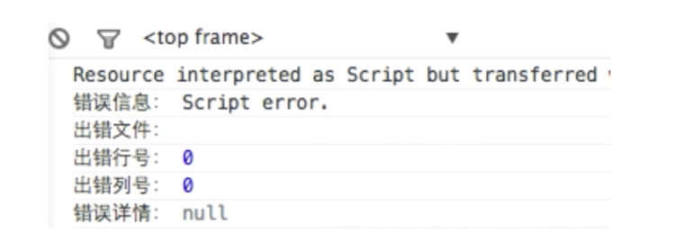

# 错误监控

* 前端错误的分类
* 错误的捕获方式
* 上报错误的基本原理

## 前端错误的分类
* 即时运行错误：代码错误
* 资源加载错误

## 错误的捕获方式
即时运行错误的捕获方式

1. try...catch
2. window.onerror

资源加载错误（[code](https://github.com/WuChenDi/Front-End/blob/master/04-%E9%9D%A2%E8%AF%95/2018%E5%B9%B4%E5%BA%95Coding/error.html)）

1. object.onerror
2. performance.getEntries()
3. Error事件捕获

延伸： 跨域的js运行错误可以捕获吗，错误提示什么，应该怎么处理？



1. 在script标签增加crossorigin属性
2. 设置js资源响应头Access-Control-Allow-Origin:*

## 上报错误的基本原理
1. 采用Ajax通信的方式上报
2. 利用image对象上报
```js
  <script type="text/javascript">
    (new Image()).src = 'http://baidu.com/tesjk?r=tksjk';
  </script>
```
